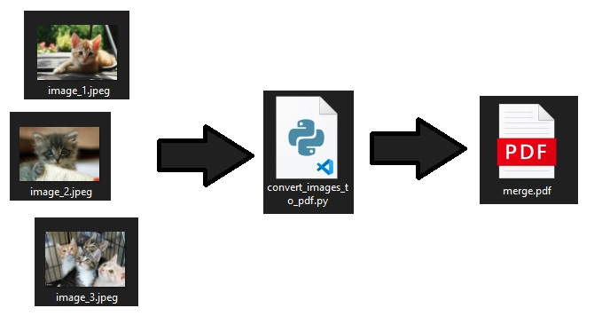

# Convert images to PDF

## Introduction

Many times you have to create a PDF staring from a list of images. The idea is to run an exe file from any folder on the PC that will take in input some images filename and it will create a PDF file. The order of the images in the PDF will be the same in which the images are passed to the exe. By default the output filename will be **merge.pdf**

## Software and Libraries

This project uses Python 3.11 and the following libraries:
* [pyinstaller](https://www.pyinstaller.org/)
* [PIL](https://pillow.readthedocs.io/en/stable/index.html)

## Local configuration

To setup a new local enviroment and install all dependencies you can run `.\my_scripts\Set-Up.ps1`. It will install:
* [Python](https://www.python.org/)
* [uv](https://docs.astral.sh/uv/)
* [Pre-commit](https://pre-commit.com/)

Pre-commit is a framework for managing and maintaining multi-language pre-commit hooks. A pre-commit hook is a script that runs before a commit operation in a version control system. This allows to shift left code quality checks and remediations. You can change the hooks by updateing the file `.pre-commit-config.yaml`.

To trigger the pre-commit hooks without an actual commit you can run `pre-commit run --all-files -v`.

## Data

Have a look at the `data` folder and its [DATA.md](data/DATA.md) file.

## Testing

No test implemented.

## Build

To build the .exe file and place it in **%USERPROFILE%\AppData\Local\Programs\Python\Python311\Scripts**
you have to run `deploy.cmd`

To check the value of the environment variable %USERPROFILE% with Windows PowerShell you have to run `$env:USERPROFILE` while on the command line you can simply run `echo %USERPROFILE%`

## Running the code

From any folder of your PC you can open a command promt and run `convert_images_to_pdf.exe image_1.jpeg image_2.jpeg` and in the same folder a **merge.pdf** file will be created.

## List of activities

In the [TODO.md](TODO.md) file you can find the list of tasks and on going activities.

## Licensing and Acknowledgements

Have a look at [LICENSE.md](LICENSE.md) and many thanks to [datatofish.com](https://datatofish.com/images-to-pdf-python/#:~:text=%20Steps%20to%20Convert%20Images%20to%20PDF%20using,the%20image%20to%20PDF%20using%20Python%20More%20) for the tips about how to convert images to PDF using python.

## Outro

I hope this repository was interesting and thank you for taking the time to check it out. On my Medium you can find a more in depth [story](https://medium.com/@simone-rigoni01/easily-convert-images-to-pdf-with-python-540093f38988) and on my Blogspot you can find the same [post](https://simonerigoni01.blogspot.com/) in italian. Let me know if you have any question and if you like the content that I create feel free to [buy me a coffee](https://www.buymeacoffee.com/simonerigoni).